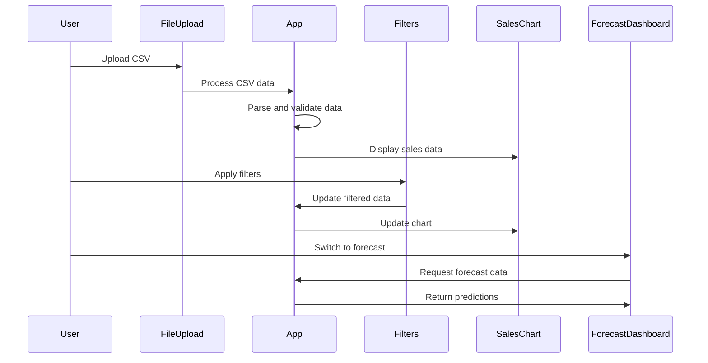
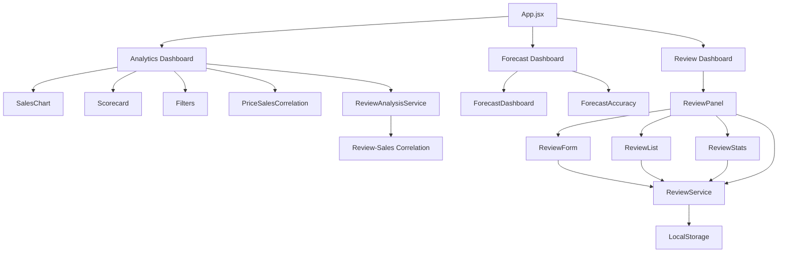
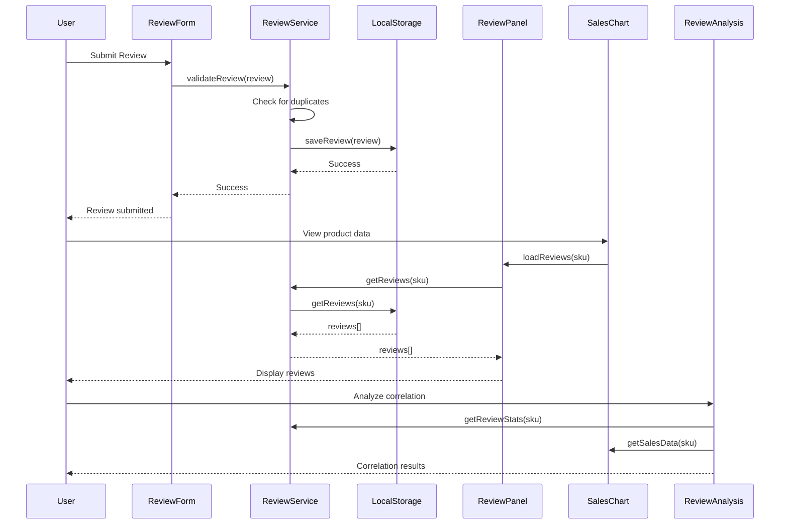

# DFS-MVP Sales Dashboard - Current Architecture & Review System Design

## Current System Overview

The DFS-MVP project is a **React-based sales analytics dashboard** built with Vite. It provides comprehensive sales data analysis, forecasting capabilities, and interactive visualizations. The system currently handles CSV data processing, sales analytics, and predictive modeling.

## Current Architecture

### Frontend Stack
- **React 18.2.0** with functional components and hooks
- **Vite** for build tooling and development server
- **Recharts** for data visualization
- **Lucide React** for icons
- **PapaParse** for CSV processing
- **Date-fns** for date manipulation

### Current Components

#### Core Dashboard Components
1. **App.jsx** - Main application container with state management
2. **FileUpload.jsx** - CSV file upload and processing
3. **Filters.jsx** - SKU, year, and month filtering
4. **SalesChart.jsx** - Interactive sales data visualization
5. **Scorecard.jsx** - Key metrics display cards

#### Analytics Components
1. **PriceSalesCorrelation.jsx** - Price impact analysis
2. **ForecastDashboard.jsx** - Sales forecasting interface
3. **ForecastAccuracy.jsx** - Forecast performance metrics

#### Services
1. **ARIMAForecastService.js** - ARIMA forecasting algorithm
2. **StatsForecastService.js** - Statistical forecasting methods
3. **PriceSalesAnalysisService.js** - Price-sales correlation analysis
4. **ForecastAccuracyService.js** - Forecast accuracy calculations
5. **PythonForecastService.js** - Python-based forecasting integration

### Current Data Flow



### Current Data Structure

#### Sales Data Model
```javascript
{
  date: Date,              // Order date
  sku: string,             // Product SKU
  orderedQuantity: number, // Units ordered
  soldQuantity: number,    // Units sold
  price: number,           // Unit price
  cost: number,            // Unit cost
  fillRate: number,        // sold/ordered ratio
  revenue: number,         // soldQuantity * price
  productionCost: number   // soldQuantity * cost
}
```

## Review System Design

### New Components to Build

#### Review Management Components
1. **ReviewPanel.jsx** - Main review interface container
2. **ReviewForm.jsx** - Review submission form with star rating
3. **ReviewList.jsx** - List of reviews for a product
4. **ReviewItem.jsx** - Individual review display
5. **ReviewStats.jsx** - Review statistics and rating distribution
6. **StarRating.jsx** - Reusable star rating component

#### Review Services
1. **ReviewService.js** - Review data management and local storage
2. **ReviewAnalysisService.js** - Review-sales correlation analysis

### Data Models

#### Review Model
```javascript
{
  id: string,           // Unique review identifier
  sku: string,          // Product SKU (links to sales data)
  rating: number,       // 1-5 star rating
  title: string,        // Review title (optional)
  comment: string,      // Review text content
  userName: string,     // User identifier
  timestamp: Date,      // Review submission time
  helpful: number,      // Helpful votes count
  verified: boolean     // Whether user purchased the product
}
```

#### ReviewStats Model
```javascript
{
  sku: string,          // Product SKU
  averageRating: number, // Average rating (1-5)
  totalReviews: number,  // Total number of reviews
  ratingDistribution: {  // Count of each rating
    1: number,
    2: number,
    3: number,
    4: number,
    5: number
  },
  lastUpdated: Date     // Last review submission time
}
```

### Integration Architecture



### Enhanced Data Flow with Reviews



### API Design (Local Storage Interface)

#### ReviewService Methods
```javascript
// Core Review Operations
saveReview(review: Review): Promise<boolean>
getReviews(sku: string): Promise<Review[]>
getReviewStats(sku: string): Promise<ReviewStats>
deleteReview(reviewId: string): Promise<boolean>

// Review Analysis
getReviewsByRating(sku: string, minRating: number, maxRating: number): Promise<Review[]>
correlateReviewsWithSales(sku: string, salesData: SalesData[]): Promise<CorrelationData>

// Data Management
exportReviews(): Promise<string>
importReviews(jsonData: string): Promise<boolean>
clearAllReviews(): Promise<boolean>
```

### UI/UX Design Principles

#### Integration Strategy
- **Seamless Integration**: Reviews appear alongside existing sales data
- **Consistent Styling**: Use existing dashboard design patterns
- **Responsive Design**: Work on desktop and mobile devices
- **Progressive Enhancement**: Reviews enhance existing functionality

#### User Experience
- **Intuitive Interface**: 3-click maximum for review submission
- **Visual Feedback**: Star ratings with hover effects
- **Real-time Updates**: Review stats update immediately
- **Contextual Information**: Reviews appear when viewing specific products

### Error Handling Strategy

#### Validation Errors
- **Invalid Rating**: Must be 1-5 stars
- **Missing Fields**: SKU and rating required
- **Duplicate Reviews**: One review per user per SKU
- **XSS Prevention**: Sanitize review content

#### Storage Errors
- **LocalStorage Full**: Implement data compression
- **Corrupted Data**: Validate on load
- **Version Mismatch**: Handle data migrations

### Performance Considerations

#### Optimization Strategies
- **Virtual Scrolling**: For large review lists
- **Caching**: Review statistics to avoid recalculation
- **Lazy Loading**: Load reviews on demand
- **Memory Management**: Limit review history per product

#### Scalability
- **10,000 Reviews**: Per product without degradation
- **2-Second Load**: For review data
- **Efficient Filtering**: Quick SKU-based lookups

### Security Implementation

#### Input Validation
- **XSS Prevention**: Sanitize all user inputs
- **Data Validation**: Validate rating values and types
- **Rate Limiting**: Prevent spam submissions

#### Data Protection
- **Local Storage**: Encrypt sensitive data
- **Data Integrity**: Validate on application startup
- **Backup Recovery**: Implement data backup mechanisms

### Testing Strategy

#### Unit Tests
- ReviewService methods (CRUD operations)
- Component rendering and interactions
- Data validation and error handling

#### Integration Tests
- Review submission workflow
- Integration with sales dashboard
- Data persistence and retrieval

#### Performance Tests
- Load testing with large datasets
- Memory usage optimization
- Local storage capacity management

### Implementation Phases

#### Phase 1: Core Review System (Week 1-2)
- ReviewService and data models
- ReviewForm and ReviewList components
- Basic local storage integration

#### Phase 2: Dashboard Integration (Week 3)
- ReviewPanel integration into App.jsx
- SKU-based filtering enhancement
- Review statistics display

#### Phase 3: Advanced Features (Week 4)
- Review-sales correlation analysis
- Export/import functionality
- Performance optimizations

### Migration Strategy
- **Backward Compatibility**: Preserve existing sales data
- **Data Format Versioning**: Handle future schema changes
- **Gradual Rollout**: Add reviews without breaking existing features
- **User Onboarding**: Clear guidance for new review features 